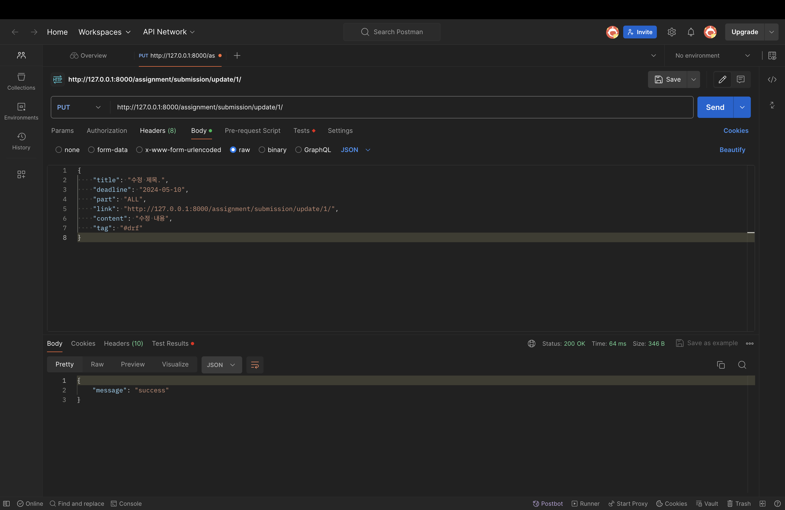

# drf-advanced-team1
drf실습 1팀 과제 레포입니다.

## #1 과제 생성(오다솔)

## #2 특정 과제 제출물 생성(오다솔)

## #3 과제 목록 조회(손가영)

assignment list api view 클래스를 이용해 구현한 class based view 입니다.

## #4 과제 내용 조회(손가영)
 
CBV를 이용해 AssignmentAPIView 클래스를 사용하여 구현되었습니다.
CBV를 이용해 6번 기능의 메소드도 함께 각 HTTP 메소드에 대응하는 로직을 내부에 구현하였습니다.

## #5 특정 과제 수정(손가영)
PUT

PATCH

FBV를 사용했으므로 이 api는 update_assignment 함수를 통해 제공됩니다. 여기서는 PUT과 PATCH 두 가지 HTTP 메소드를 지원합니다

## #6 특정 과제 삭제(손가영)

위 4번 기능의 CBV에서 함께 구현되었습니다.

## #7 과제 파트별 조회(배민혁)
- 전체 조회

- 백엔드 조회 

- 프론트엔드 조회  

## #8 과제 태그별 조회(배민혁)
- 태그 조회 성공  

- 태그 조회 실패  

